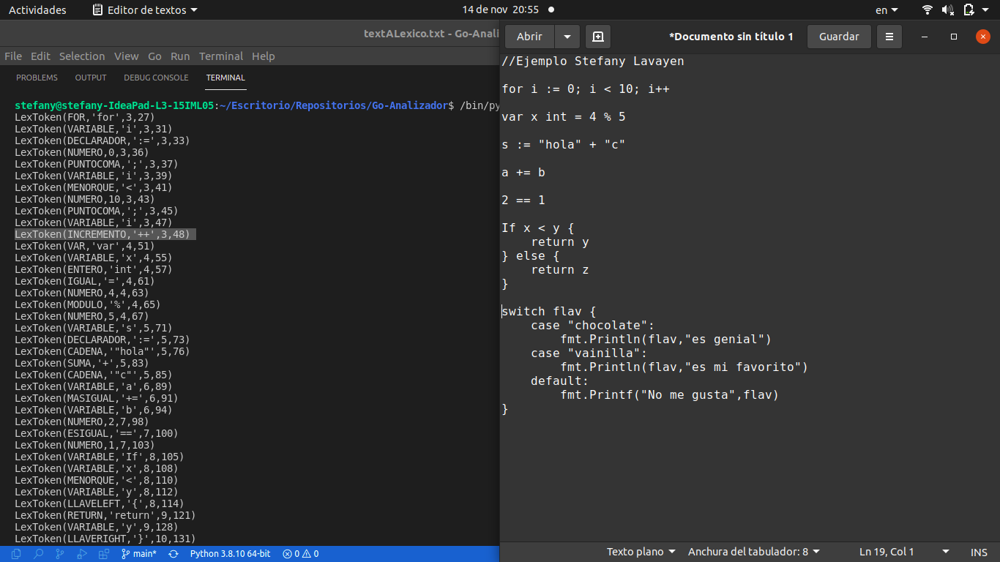
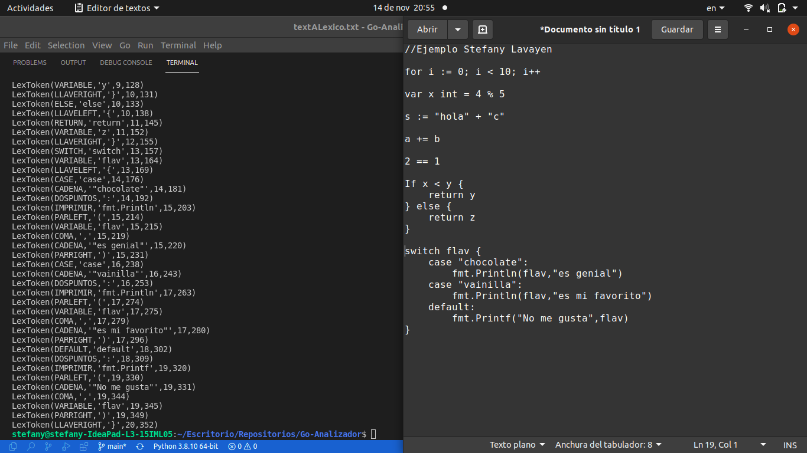
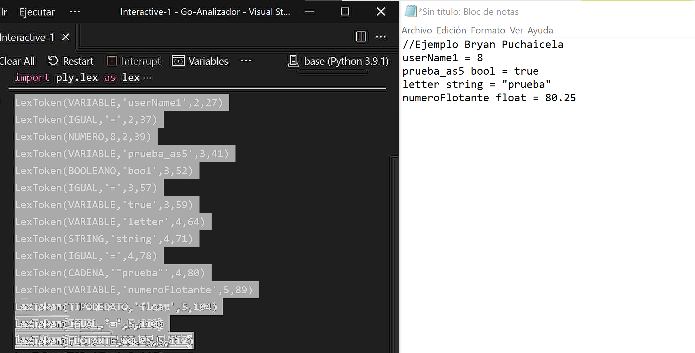
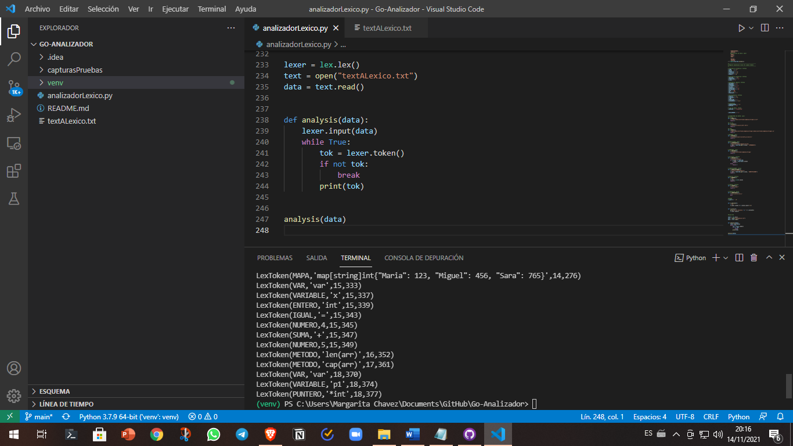

# Analizador Lexico

### Avance 01: 
```
1. Definir los tokens que serán reconocidos en su LP
2. Usando el módulo lex de PLY definir los tokens necesarios para su analizador léxico.
3. Adicionalmente, suba capture o video de que se reconoce cada token.
```
### Autores ✒️
* **Stefany Lavayen** - *Trabajo* - [stefa17pj](https://github.com/stefa17pj)
* **Bryan Puchaicela** - *Trabajo* - [bryapuch](https://github.com/bryapuch)
* **Jahir Veliz** - *Trabajo* - [jarvacan](https://github.com/jarvacan)


## ScreenShots Stefany Lavayen

<p align="center">
  
</p>

<p align="center">
  
</p>

## ScreenShots Bryan Puchaicela
<p align="center">
  
</p>


## ScreenShots Jahir Veliz

<p align="center">
  
</p>